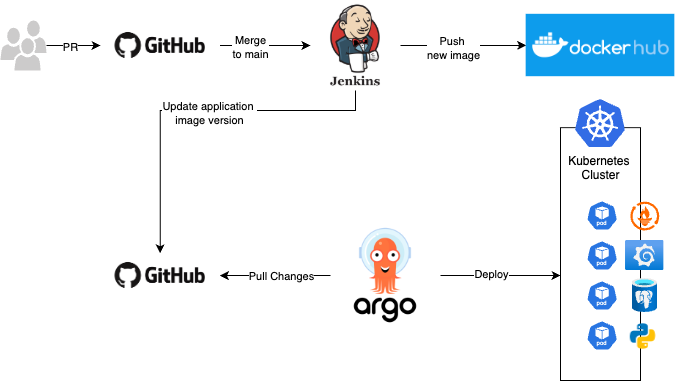

# Welcome to Our Project Page

This is the main page for our final project in the DevSecOps course.

The following image describer the structure of our project.

The project was implemented in two repositories.

## The Microservices

The backend (include its swagger) and all other microservices information
(include the k8s files) are in the repository
[microservices](https://github.com/DevSecOps18Project1/microservices).

## The DevOps

All the information of the DevOps are in the repository
[DevOps](https://github.com/DevSecOps18Project1/DevOps).
